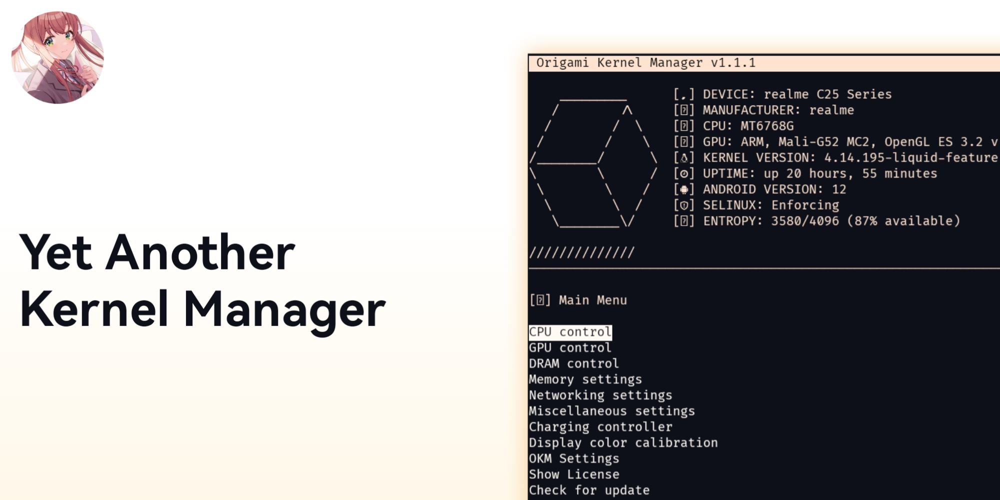

# Origami Kernel Manager

## About

The Origami Kernel Manager script is a versatile tool designed to empower users with an array of features, facilitating kernel adjustments, management, and optimization through the command line interface (CLI). It aims to deliver a comprehensive solution for enhancing device performance and customization by providing various settings for kernel fine-tuning.

## Description

This script offers an extensive range of functionalities, enabling users to:
- Modify advanced settings
- Manage CPU and GPU frequencies, governor, scheduler and many more
- Customize display colors
- Configure networking and firewall settings
- Access specific features tailored for manufacturers and SoCs (System on Chips)
- Control charging parameters
- Control memory parameters

## Installation and running Origami kernel manager

### Requirements
- Rooted Android device
- Termux app installed
- Installed following dependencies: `make fzf fzy jq`

### Installation
To install the Origami Kernel Manager:
- Launch your Termux environment.
- Clone this repository.
- Navigate to the repository directory.
- Execute the following command for installation: `make install`. To uninstall, use `make uninstall`.
- Once installed, run with `sudo origami-kernel`.

## Compatibility

Presently, complete support is available for Mediatek devices, while specific features are tailored for Realme, Oppo, and OnePlus devices.

## Contribution

Contributions are encouraged! Whether it's through issue submissions or pull requests, your input is valued in enhancing the Origami Kernel Manager script.

## License

This script operates under the GNU General Public License v3.0. Refer to the LICENSE file for detailed licensing information.

---

**Note:** As licensed under GNU General Public License v3.0, this software is came with ABSOLUTELY NO WARRANTY. By using this software, you accept all responsibility using it and agree that am not responsible for any actions you make that has an adverse effect on your device.