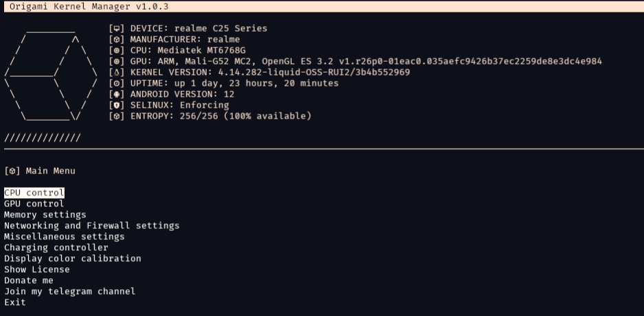

# Origami Kernel Manager

---

Yet another kernel manager.

## About

Origami Kernel Manager is a set of utilities for power users to tune, adjust, and manage the kernel parameters through the command line interface (CLI), specifically on termux. It aims to deliver a comprehensive solution for enhancing device performance and customization by providing various settings for kernel fine-tuning.

More info and documentation on [Origami Kernel Manager wiki](https://github.com/Rem01Gaming/origami_kernel_manager/wiki).

## Why need a kernel manager?

- Performance Optimization
  - Fine-tune CPU frequencies, governor profiles, and memory management for enhanced system performance.

- Battery Life Improvement
  - Optimize power-related settings to extend battery life by efficiently managing CPU power, power-saving features, and charging control.

- Customization and Features
  - Customize additional features on kernel that not available in your settings, such as display color calibration, Selinux, low memory killer, or advanced network settings.

- Stability and Reliability
  - Switch between different configurations to find a balance between performance and stability, ideal for users experimenting with kernel stuff.

## Features
- CPU and GPU control such as changing Governor, set max and min freq, Core control, and Governor parameter tuning
- GPU Extension Device (GED) Tune for Mediatek
- Adreno Idler and Simple GPU tune for Qualcomm Snapdragon
- Memory parameters setting, DRAM Control for Mediatek
- Networking and Firewall settings, such as TCP Congestion algorithm, SYN Cookies, TCP Low latency mode, BPF JIT Harden, etc.
- Idle Charging controller
- Selinux switch mode
- MTK Videox Livedisplay and KCAL Display color calibration
- Thermal Governor setting
- Touchpanel settings for oplus devices (Oppo/Realme/OnePlus), Double Tap To Wake switch
- I/O Scheduler setting
- Mediatek tailored features such as APUs frequency, Performance and Power Management, Power Budget Management and more

## Installation and running Origami Kernel Manager

### Requirements
- Rooted Android device
- Termux app installed
- Installed following dependencies: `tsu fzf fzy`
- Working brain 🧠 with minimal cli knowledge

### Installation with deb package
- Download deb package from GitHub release
- Navigate to the Download directory
- Execute the following command for installation: `apt install ./origami-kernel.deb`. To uninstall, use `apt remove origami-kernel`.
- Once installed, run with `sudo origami-kernel`

### Installation with make
- Clone this repository
- Navigate to the repository directory
- Execute the following command for installation: `make install`. To uninstall, use `make uninstall`.
- Once installed, run with `sudo origami-kernel`

PS: You need `make` and `git` installed on your termux for this method.

## Contribution

Contributions are encouraged! Whether it's through issue submissions or pull requests, your input is valued in enhancing the Origami Kernel Manager.

## License

This project is licensed under the GNU General Public License v3.0 or later. Refer to the [LICENSE](/LICENSE) file for detailed licensing information.

## Warning

The author assumes no responsibility under anything that might break due to the use/misuse of this software. By choosing to use/misuse it, you agree to do so at your own risk!

One of feature of Origami Kernel Managers, Charging controller manipulates Android low level (kernel) parameters which control the charging circuitry. Some devices, notably from Xiaomi (e.g., Poco X3 Pro), have a faulty PMIC (Power Management Integrated Circuit) that can be triggered by Charging controller feature. The issue blocks charging. Ensure the battery does not discharge too low.

Refer to [this XDA post](https://xdaforums.com/t/rom-official-arrowos-11-0-android-11-0-vayu-bhima.4267263/page-14#post-85119331) for additional details.

[lybxlpsv](https://github.com/lybxlpsv) suggests booting into bootloader/fastboot and then back into system to reset the PMIC.

